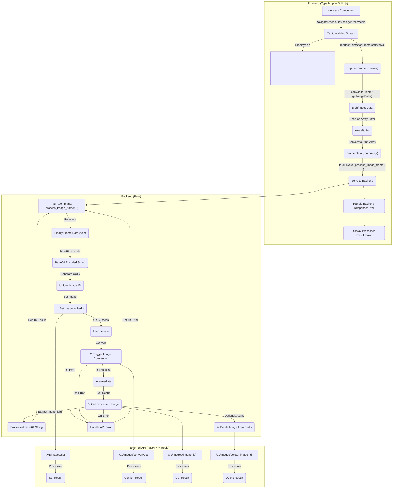

# 実装計画: Tauri + Webカメラ リアルタイム画像処理 (複数API呼び出し版)

**1. 目的:**

Webカメラからリアルタイムで映像を取得し、指定されたフレームレートでフレームをキャプチャ。キャプチャした画像データを
Tauri バックエンド (Rust) に送信し、そこで Base64 エンコード後、外部 API
サーバーへ複数回のリクエスト（set -> convert ->
get）を送信して処理を実行し、結果を取得する。API
の結果をフロントエンドに返し、表示または利用する。

**2. システム構成図 (Mermaid):**

**3. 実装ステップ:**

- **ステップ 1: 環境設定と依存関係の追加:**
  - **Rust (`src-tauri/Cargo.toml`):** `reqwest` (with `json` feature),
    `base64`, `tokio` (with `full` or necessary features like `macros`,
    `rt-multi-thread`), `serde` (with `derive` feature), `serde_json`,
    `thiserror` (推奨), `uuid` (with `v4` and `serde` features) を追加。
  - **TypeScript (`package.json`):** `@tauri-apps/api` が存在することを確認。

- **ステップ 2: バックエンド (Rust) 実装 (`src-tauri/src/lib.rs`)**
  1. **エラー型 (`AppError`) と APIレスポンス型 (`ApiResponse`,
     `ProcessedImageResponse`) の定義:**
     API仕様に合わせて定義。`/v1/images/{id}` のレスポンス `{ "image": "..." }`
     に合わせた型を追加。
  2. **Tauri State の設定:** `reqwest::Client` を保持する `AppState`
     を定義し、`manage()` で登録。
  3. **`process_image_frame` コマンドの定義:**
     - `async fn` として定義。
     - 引数: `frame_data: Vec<u8>`, `state: State<AppState>`。
     - `frame_data` を Base64 エンコード。
     - `uuid::Uuid::new_v4()` で一意の ID を生成。
     - **API Call 1: `/v1/images/set` (POST)**
       - URL: `"{api_base_url}/v1/images/set?image_id={id}"`
       - Body: `serde_json::json!({ "image_data": base64_string })`
       - レスポンスを確認。エラーなら `AppError` を返す。
     - **API Call 2: `/v1/images/convert/dog` (POST)**
       (または他の変換エンドポイント)
       - URL: `"{api_base_url}/v1/images/convert/dog?image_id={id}"`
       - Body: なし (API仕様による)
       - レスポンスを確認。エラーなら `AppError` を返す。
     - **API Call 3: `/v1/images/{image_id}` (GET)**
       - URL: `"{api_base_url}/v1/images/{id}"`
       - レスポンスボディを `{ "image": String }`
         形式の構造体にデシリアライズ。エラーなら `AppError` を返す。
     - 取得した Base64 文字列 (`response.image`) を含む `ProcessedImageResponse`
       を生成して `Ok()` で返す。
     - **API Call 4 (Optional): `/v1/images/delete/{image_id}` (GET)**
       - 上記処理が成功した後、`tokio::spawn` を使って非同期で削除 API
         を呼び出す。ここでのエラーはフロントエンドには返さない（ログ出力は推奨）。
  4. **Tauri アプリケーションのビルド:** `tauri::Builder` に State と
     `process_image_frame` コマンドを登録。

- **ステップ 3: フロントエンド (TypeScript) 実装 (`src/App.tsx`
  または新規コンポーネント)**
  1. **状態管理:** カメラストリーム、処理結果、エラーメッセージ用の Signal
     (`createSignal`) を定義。
  2. **コンポーネント:** `<video>`, `<canvas>` (一時用),
     結果/エラー表示要素を配置。`ref` を使用。
  3. **カメラアクセス:** `onMount` で `getUserMedia` を呼び出し、`<video>`
     にストリームを設定。エラーハンドリング。
  4. **フレームキャプチャと送信:** `setInterval` または `requestAnimationFrame`
     で定期実行。
     - `<video>` から `<canvas>` へ描画。
     - Canvas から `Uint8Array` を取得。
     - `Uint8Array` を数値配列に変換 (`Array.from()`)。
     - `invoke('process_image_frame', { frame_data: numberArray })`
       を呼び出す。`try...catch` でエラーハンドリング。
  5. **結果のハンドリング:** `invoke` の結果 (成功/失敗) を Signal
     にセットして表示。
  6. **クリーンアップ:** `onCleanup` でストリーム停止、タイマー解除。

- **ステップ 4: エラーハンドリング**
  - **フロントエンド:** カメラアクセス権限、`invoke`
    呼び出し、バックエンドからの `AppError`。
  - **バックエンド:** Base64 エンコード、各 API 呼び出し (set, convert, get,
    delete)、レスポンスデシリアライズ。これらを `AppError` に集約。

- **ステップ 5: パフォーマンス考慮事項**
  - **フレームレート:** `setInterval`/`requestAnimationFrame` の頻度調整。
  - **画像サイズ:** 必要に応じてリサイズ検討。
  - **API 遅延:** 複数回の API
    呼び出しによる遅延を考慮。フレームレートを下げる、処理中インジケーターを表示するなどの
    UI/UX 的配慮が必要になる可能性。
  - **非同期処理:** Rust 側は `async`/`await` を適切に使用。`reqwest::Client`
    の再利用。
  - **API 通信:** タイムアウト設定。

**API Base URL:**

Rust コード内で API のベース URL (例: `http://localhost:8000`)
を設定する必要があります。
